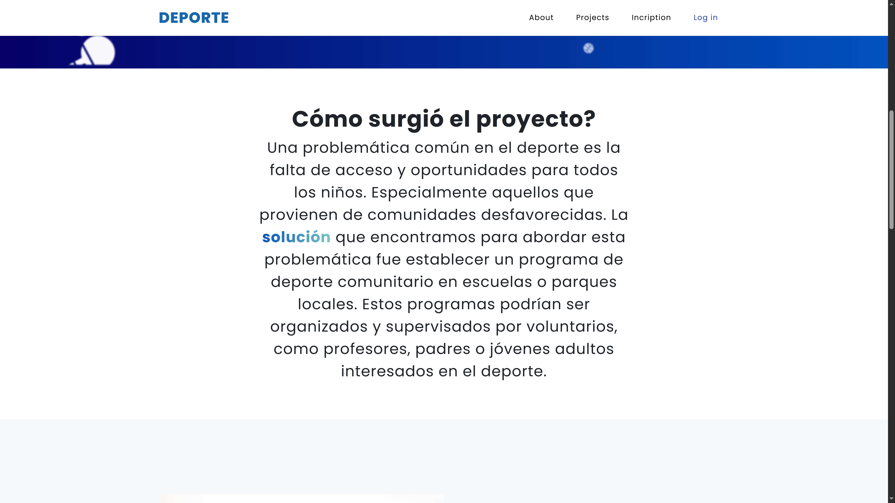
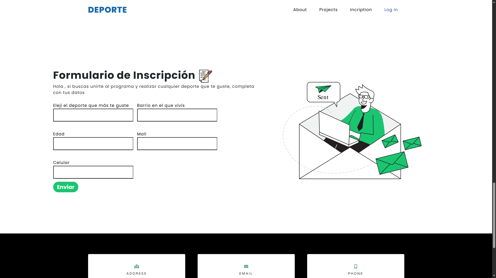

 

# 📒Proyecto Final Aprende Programando

pProyecto final del curso de desarrollo web 2 en aprendé programando.
Es una landing Page, iniciativa la cual busca ayudar a aquellos niños o adolescentes que no cuentan con la oportunidad de practicar su deporte favorito o que no tienen acceso a instalaciones deportivas adecuadas, entrenadores calificados o equipos necesarios para participar en deportes organizados.

